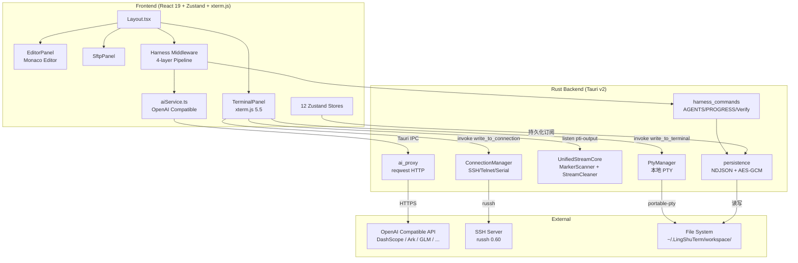

# 00 — 项目概览

## 项目核心功能

灵枢智能终端 3.0（LingshuTerm 3.0）是一款基于 **Tauri v2** 的跨平台智能终端工具，核心能力包括：

- **多协议终端访问**：本地 PTY（PowerShell / Bash / Zsh）、SSH（纯 Rust 实现 via russh）、Telnet、串口（Serial）
- **Harness 中间件架构**：Agent = Model + Harness，在 NL→Commands 管道上插入权限护栏、上下文注入、进度落盘、验证循环四层中间件
- **AI 自然语言转命令**：OpenAI 兼容 API 调用，将自然语言转换为可执行 Shell 命令序列，支持多服务商切换
- **结构化输出渲染**：自动识别 `df`、`ps`、`git status`、`ls -al`、JSON、Mermaid 等输出并渲染为富交互卡片
- **服务器状态监控**：SSH 连接时实时显示远端 CPU/MEM/DISK/NET/USERS 统计，鼠标悬停展示详细信息
- **集成服务管理**：一键启停 TFTP/FTP/HTTP/SSH/Telnet/NFS/VNC 等 9 种网络服务
- **SFTP 文件管理**：基于 SSH 的远程文件浏览、上传、下载、编辑
- **Monaco 代码编辑器**：集成 Monaco Editor，支持多 Tab 虚拟工作区
- **会话管理**：树形目录分组、HTML5 拖拽排序、右键菜单、加密持久化
- **终端日志审计**：实时记录输入输出、自动轮转（10MB）、文件树查看器

## 技术栈清单

| 层级 | 技术 | 版本 | 用途 |
|------|------|------|------|
| **桌面框架** | Tauri | v2 | 跨平台桌面容器、系统调用 |
| **前端框架** | React | 19.1 | UI 组件渲染 |
| **状态管理** | Zustand | 5.0 | 全局状态（12 个独立 Store） |
| **终端渲染** | xterm.js | 5.5 | 终端模拟 + FitAddon + WebglAddon |
| **代码编辑器** | Monaco Editor | 0.55 | 代码编辑视图 |
| **图标库** | Lucide React | 0.400 | 矢量图标 |
| **Markdown** | react-markdown + remark-gfm | 9.1 / 4.0 | Blocks 输出渲染 |
| **语法高亮** | Shiki | 4.0 | 代码块着色 |
| **图表** | Mermaid | 11.14 | 流程图渲染 |
| **CSS 框架** | Tailwind CSS | 3.4 | 原子化样式，自定义深色主题 |
| **后端语言** | Rust | Edition 2021 | PTY 管理、网络连接、持久化、AI Proxy |
| **异步运行时** | Tokio | 1 | Rust 异步任务调度 |
| **PTY 库** | portable-pty | 0.8 | 跨平台伪终端 |
| **SSH 库** | russh (ring 后端) | 0.60 | 纯 Rust SSH 客户端 |
| **SFTP** | russh-sftp | 2.1 | SSH 文件传输协议 |
| **串口** | serialport | 4.3 | COM 端口通信 |
| **加密** | ring | 0.17 | AES-256-GCM 密码存储 |
| **序列化** | serde + serde_json | 1 | Rust ↔ JSON 互转 |
| **HTTP 客户端** | reqwest | 0.12 | 调用 OpenAI 兼容 API |
| **构建工具** | Vite | 7.0 | 前端构建 & HMR |
| **测试框架** | Vitest | 4.1 | 前端单元测试 (jsdom) |
| **类型检查** | TypeScript | 5.8 | 严格模式类型检查 |

## 顶层架构设计

### Agent = Model + Harness

LingshuTerm 3.0 的核心设计理念是将 AI Agent 拆分为 **Model（模型调用）** 和 **Harness（驾驭中间件）** 两层：

```
┌────────────────────────────────────────┐
│              用户输入                    │
└────────────────┬───────────────────────┘
                 │
                 ▼
┌────────────────────────────────────────┐
│  [1] Context Injector                   │
│   AGENTS.md → System Prompt 注入        │
│   PROGRESS.md → 任务上下文恢复          │
└────────────────┬───────────────────────┘
                 │
                 ▼
┌────────────────────────────────────────┐
│  [2] LLM Call (Model)                   │
│   aiService.nlToTasks()                 │
│   Rust ai_proxy → OpenAI 兼容 API       │
└────────────────┬───────────────────────┘
                 │
                 ▼
┌────────────────────────────────────────┐
│  [3] Permission Manager (Guard)         │
│   alwaysDeny → 拒绝                     │
│   alwaysAllow → 通过                    │
│   alwaysAsk → ConfirmDialog 用户确认    │
└────────────────┬───────────────────────┘
                 │
                 ▼
┌────────────────────────────────────────┐
│  [4] Command Execution                  │
│   Block System: execute_block_command   │
│   OSC 7701 标记追踪 exit code           │
└────────────────┬───────────────────────┘
                 │
                 ▼
┌────────────────────────────────────────┐
│  [5] Progress + Verification            │
│   PROGRESS.md 进度落盘                  │
│   验收命令执行 + 失败回传 LLM 重试       │
└────────────────┬───────────────────────┘
                 │
                 ▼
              输出结果
```

## 系统架构总览



### 前后端分层架构

```
┌──────────────────┐     Tauri invoke      ┌──────────────────────┐
│   React Frontend  │ ◄──────────────────► │   Rust Backend        │
│                   │    (IPC Bridge)       │                       │
│  ┌─────────────┐  │                       │  ┌─────────────────┐ │
│  │ Zustand     │  │                       │  │ PtyManager      │ │
│  │ Stores (12) │  │                       │  │ (本地 PTY)       │ │
│  ├─────────────┤  │                       │  ├─────────────────┤ │
│  │ xterm.js    │  │                       │  │ ConnectionMgr   │ │
│  │ Monaco      │  │                       │  │ (SSH/Telnet/Ser)│ │
│  ├─────────────┤  │                       │  ├─────────────────┤ │
│  │ Harness     │  │                       │  │ ServerManager   │ │
│  │ Middleware  │  │                       │  │ (网络服务)       │ │
│  ├─────────────┤  │                       │  ├─────────────────┤ │
│  │ AI Service  │──┼─── ai_proxy ────────► │  │ AI Proxy        │ │
│  │ (TypeScript) │  │                       │  │ (reqwest)       │ │
│  └─────────────┘  │                       │  └─────────────────┘ │
└──────────────────┘                       └──────────────────────┘
```

### Session ID 命名规范

前端通过 Session ID 前缀路由到对应的 Rust 后端管理器：

| 前缀 | 协议 | 示例 | Rust 管理器 |
|------|------|------|-------------|
| `session-` | 本地 PTY | `session-1` | `PtyManager` |
| `ssh-` | SSH 远程 | `ssh-3` | `ConnectionManager` |
| `telnet-` | Telnet | `telnet-2` | `ConnectionManager` |
| `serial-` | 串口 | `serial-1` | `ConnectionManager` |

路由逻辑位于 [`sessionUtils.ts:3-20`](../src/lib/sessionUtils.ts)。

### 关键事件流

```
PTY/SSH 输出
    │
    ├─ UnifiedStreamCore (Rust)
    │   ├─ MarkerScanner: 扫描 OSC 7701 标记 → block-cmd-started / block-cmd-completed
    │   ├─ StreamCleaner: OSC 133 状态机 → block-output
    │   └─ output_sanitizer: 清洗 ANSI/Prompt 噪音 → pti-output
    │
    ▼
useSessionStream (前端 Hook)
    ├─ terminal.write(data) → xterm.js 渲染
    └─ sessionLogStore.appendLog() → 持久化
```

## 快速启动

### 环境要求

- **Node.js** >= 18
- **Rust** >= 1.80 (with `rustup`)
- **Windows**: Visual Studio Build Tools (C++ workload)
- **macOS**: Xcode Command Line Tools
- **Linux**: `libwebkit2gtk-4.1-dev` + `libgtk-3-dev`

### 开发命令

```bash
# 1. 安装前端依赖
npm install

# 2. 启动 Tauri 开发模式（前端 HMR + Rust 热编译）
npm run tauri:dev

# 3. 仅启动前端开发服务器（用于 UI 调试）
npm run dev

# 4. TypeScript 类型检查
npx tsc --noEmit

# 5. Rust 类型检查
cd src-tauri && cargo check

# 6. 前端单元测试
npx vitest run

# 7. Rust 单元测试
cd src-tauri && cargo test

# 8. 生产构建
npm run tauri:build
```

### 项目配置

- **AI 服务商**: 设置面板 → AI 标签，支持百炼(DashScope)、火山方舟(Ark)、智谱(GLM)、OpenAI、Ollama 等
- **Harness 规则**: 设置面板 → Harness 标签，配置 deny/ask 规则列表
- **AGENTS.md**: 项目根目录，定义 AI 行为规范、安全禁区、验收命令
- **PROGRESS.md**: 项目根目录 → sessions/{id}/，自动管理跨会话任务进度

### 工作空间路径

- **Windows**: `%USERPROFILE%\.LingShuTerm\workspace\`
- **macOS/Linux**: `~/.LingShuTerm/workspace/`

工作空间包含：加密的连接配置 (`connections.json`)、会话持久化数据 (`sessions/`)、终端日志 (`logs/`)、加密密钥 (`.key`)。
