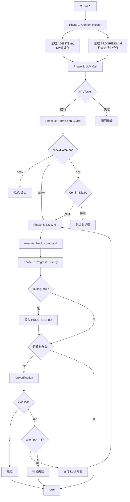

# 01 — Harness 中间件系统

## 功能职责

Harness 中间件系统实现了 **Agent = Model + Harness** 架构的驾驭层。它在现有的 NL→Commands 管道上插入 4 层独立中间件，将简单的"用户输入→LLM→命令列表"升级为完整的"注入→规划→校验→执行→验证"流水线。

**核心公式**：控制 AI 的行为不是靠更好的 Prompt，而是靠结构化的工程约束。

## 核心数据结构

### Pipeline 入口类型 ([types.ts:5-120](../src/lib/harness/types.ts))

```typescript
// 权限判定结果
type GuardAction = 'deny' | 'allow' | 'ask';

interface GuardResult {
  action: GuardAction;
  matchedRule: GuardRule | null;
  auditEntry: GuardAuditEntry;
}

// Pipeline 配置
interface HarnessConfig {
  guardRules: GuardRule[];        // 权限规则集
  agentsPath: string;             // AGENTS.md 路径
  progressPath: string;           // PROGRESS.md 路径
  maxVerifyRetries: number;       // 最大重试次数（默认 3）
  longTaskStepThreshold: number;  // 长任务步数阈值（默认 3）
  longTaskLengthThreshold: number;// 长任务长度阈值（默认 500）
}

// Pipeline 执行结果
interface PipelineResult {
  steps: AiTaskStep[];            // LLM 返回的命令步骤
  guardResults: GuardResult[];    // 每个命令的权限判定
  verifyResults: VerifyResult[];  // 验收命令执行结果
  progressUpdated: boolean;       // 是否写入了 PROGRESS.md
  finalStatus: PipelineFinalStatus;
  summary: string;                // 人类可读的摘要
}
```

### 配置默认值 ([defaults.ts:65-72](../src/lib/harness/defaults.ts))

```typescript
const DEFAULT_HARNESS_CONFIG: HarnessConfig = {
  guardRules: [...DENY_RULES, ...ALLOW_RULES, ...ASK_RULES],
  agentsPath: 'AGENTS.md',
  progressPath: 'PROGRESS.md',
  maxVerifyRetries: 3,
  longTaskStepThreshold: 3,
  longTaskLengthThreshold: 500,
};
```

## 架构图

```mermaid
graph TD
    subgraph "Harness Middleware System"
        CI[Context Injector<br/>contextInjector.ts]
        PM[Permission Manager<br/>permissionManager.ts]
        PW[Progress Writer<br/>progressWriter.ts]
        VR[Verification Runner<br/>verificationRunner.ts]
    end

    subgraph "External"
        UI[User Input]
        LLM[AI Service<br/>aiService.ts]
        EXEC[Block System<br/>execute_block_command]
        AGENTS[AGENTS.md]
        PROGRESS[PROGRESS.md]
        DIALOG[ConfirmDialog.tsx]
    end

    UI -->|query| CI
    CI -->|read| AGENTS
    CI -->|read| PROGRESS
    CI -->|systemPrompt + messages| LLM
    LLM -->|AiTaskStep[]| PM
    PM -->|deny| REJECT[Reject]
    PM -->|ask| DIALOG
    DIALOG -->|approved| EXEC
    DIALOG -->|denied| SKIP[Skip Step]
    PM -->|allow| EXEC
    EXEC -->|exitCode| PW
    PW -->|write| PROGRESS
    PW -->|verifyCommands| VR
    VR -->|retry on fail| LLM
    VR -->|pass| DONE[Task Complete]
```

## 流程图



## 代码逻辑框架

### 主 Pipeline 编排器 ([harnessPipeline.ts:52-170](../src/lib/harness/harnessPipeline.ts))

`runPipeline()` 是唯一的入口函数，替代了原有的 `aiService.nlToTasks()` 直接调用：

```
runPipeline(userInput, sessionId, callbacks, config?)
  │
  ├─ Phase 1: buildInjection(sessionId, userInput)
  │   └─ contextInjector.ts → AGENTS.md + PROGRESS.md
  │
  ├─ Phase 2: nlToTasks(aiConfig, userInput, signal, injection.messages)
  │   └─ aiService.ts → OpenAI 兼容 API
  │
  ├─ Phase 3: for each step → checkCommand() → onConfirm()
  │   ├─ permissionManager.ts → deny/allow/ask
  │   └─ ConfirmDialog.tsx (用户交互)
  │
  ├─ Phase 4: isLongTask() → progressWriter.save()
  │   └─ progressWriter.ts → PROGRESS.md
  │
  └─ Phase 5: runVerification()
      └─ verificationRunner.ts → 验收 + 重试循环
```

### 回调接口

```typescript
interface PipelineCallbacks {
  onConfirm: (step, guardResult) => Promise<boolean>;  // 权限确认
  onExecuteStart: (step) => void;                       // 命令开始
  onExecuteEnd: (step, exitCode) => void;               // 命令结束
  onProgress: (status) => void;                         // 进度更新
  signal?: AbortSignal;                                  // 取消信号
}
```

### 与现有系统的对接

| 对接点 | 文件 | 变更说明 |
|--------|------|---------|
| AI 调用入口 | [useAiSubmit.ts:128-178](../src/hooks/useAiSubmit.ts) | LLM 路径改为调用 `runPipeline()` |
| 权限弹窗 | [Layout.tsx:186-194](../src/components/Layout.tsx) | 渲染 `<ConfirmDialog>` |
| 设置持久化 | [settingsStore.ts:7-24](../src/stores/settingsStore.ts) | AppSettings 新增 `harness: HarnessConfig` |
| 默认规则 | [defaults.ts:9-63](../src/lib/harness/defaults.ts) | deny 10条 + allow 30条 + ask 16条 |

## 扩展点与约束

### 如何新增权限规则

在 [defaults.ts](../src/lib/harness/defaults.ts) 中向 `DENY_RULES`、`ALLOW_RULES` 或 `ASK_RULES` 数组添加条目：

```typescript
{
  label: 'my-rule',            // 唯一标识
  pattern: '^mycommand\\b',    // 正则表达式（匹配完整命令）
  action: 'deny' | 'allow' | 'ask',
  reason: '人类可读的原因（显示在确认弹窗中）',
}
```

规则按 deny → allow → ask 顺序检查，首个命中即返回。

### 约束

- **单轮规划**：Harness 不支持多轮 Agent 循环。LLM 一次性生成全部命令，Harness 执行后校验。
- **验收命令来源**：仅支持从 AGENTS.md 的 `` ```bash ``` `` 代码块提取（regex 匹配 `## 验收命令` 区块）。
- **PROGRESS.md 恢复**：仅在 `progressWriter.load()` 返回状态为"进行中"时触发，依赖 Markdown 格式的正则解析。
- **`run_verify_cmd`**：当前仅支持 SSH 会话（[harness_commands.rs:60-68](../src-tauri/src/harness_commands.rs)），本地会话返回占位结果。
