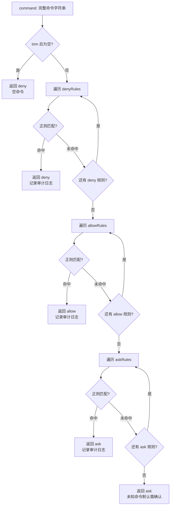
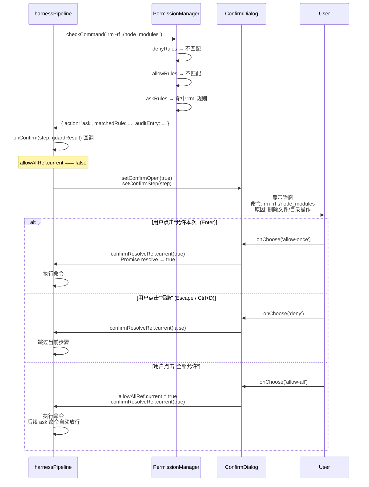

# 02 — 权限护栏系统

## 功能职责

权限护栏（Permission Guard）是 Harness 中间件的安全层。它拦截 LLM 生成的每一条命令，根据预定义规则进行三级判定，防止危险命令在无用户知情的情况下执行。

**核心价值**：将安全策略从 Prompt（容易被绕过）提升到代码层（强制执行）。

## 核心数据结构

### 规则定义 ([types.ts:10-23](../src/lib/harness/types.ts))

```typescript
interface GuardRule {
  label: string;      // 唯一标识（如 'rm-rf-root', 'npm-install'）
  pattern: string;    // 正则表达式（不区分大小写）
  action: GuardAction; // 'deny' | 'allow' | 'ask'
  reason?: string;    // 人类可读的原因（在 ConfirmDialog 中显示）
}

interface GuardAuditEntry {
  command: string;       // 被检查的命令
  action: GuardAction;   // 判定结果
  matchedLabel: string;  // 命中的规则标识
  timestamp: number;
  reason?: string;
}
```

### 规则引擎 ([permissionManager.ts:1-95](../src/lib/harness/permissionManager.ts))

```typescript
function checkCommand(command: string, rules: GuardRule[]): GuardResult {
  // 1. 按 action 分组：deny / allow / ask
  // 2. 依次检查 deny → allow → ask
  // 3. 每个分组内遍历规则，首个正则命中即返回
  // 4. 默认：未命中任何规则 → 返回 'ask'（未知命令需要确认）
}
```

## 流程图

### 规则匹配流程



### ConfirmDialog 交互时序



## 代码逻辑框架

### 规则匹配流程

```
checkCommand("rm -rf ./node_modules", rules)
  │
  ├─ 1. 空命令检查
  │     command.trim() === '' → deny
  │
  ├─ 2. denyRules 遍历
  │     "rm -rf ./node_modules" vs /rm\s+-rf\s+\//
  │     → 不匹配（目标是 ./node_modules 而非 /）
  │
  ├─ 3. allowRules 遍历
  │     "rm -rf ./node_modules" vs /^rm\b/
  │     → 不匹配（rm 规则在 askRules 中）
  │
  ├─ 4. askRules 遍历
  │     "rm -rf ./node_modules" vs /^rm\b/
  │     → 匹配！返回 { action: 'ask', matchedRule: rm-rule }
  │
  └─ 5. 记录审计日志 → 返回 GuardResult
```

### 默认规则集 ([defaults.ts:9-63](../src/lib/harness/defaults.ts))

**DENY_RULES（10 条）**：

| 标识 | 正则 | 说明 |
|------|------|------|
| `rm-rf-root` | `rm\s+-rf\s+/` | 递归删除根目录 |
| `rm-rf-root-preserve` | `rm\s+-rf\s+--no-preserve-root\s+/` | 强制删除根目录 |
| `rm-rf-home` | `rm\s+-rf\s+~` | 删除用户主目录 |
| `dd-overwrite` | `dd\s+if=.*of=/dev/` | 覆写磁盘设备 |
| `redirect-device` | `>\s*/dev/sd` | 重定向到磁盘 |
| `mkfs-format` | `mk(fs\|e2fs)` | 格式化磁盘 |
| `fork-bomb` | `:\(\)\{\s*:\|:&\s*\};:` | Fork bomb |
| `chmod-777-root` | `chmod\s+-R\s+777\s+/` | 全局权限开放 |
| `chmod-000-root` | `chmod\s+-R\s+000\s+/` | 全局权限锁定 |
| `chown-root` | `chown\s+-R\s+.*\s+/` | 递归变更根目录所有者 |

**ALLOW_RULES（30 条）**：涵盖 `ls`、`cd`、`pwd`、`cat`、`grep`、`find`、`ps`、`git status`、`npm test`、`cargo check` 等只读/无害命令。

**ASK_RULES（16 条）**：涵盖 `rm`、`mv`、`chmod`、`chown`、`kill`、`systemctl`、`reboot`、`shutdown`、`npm install`、`docker`、`git push` 等需要确认的命令。

### ConfirmDialog 组件 ([ConfirmDialog.tsx:1-120](../src/components/ConfirmDialog.tsx))

```
┌─────────────────────────────────────────────┐
│  ⚠ 权限确认                                 │
├─────────────────────────────────────────────┤
│  即将执行的命令:                             │
│  $ rm -rf ./node_modules                    │
│  描述: 删除 node_modules 目录               │
│  ! 删除文件/目录操作                         │
├─────────────────────────────────────────────┤
│  [拒绝]              [允许本次]  [全部允许]  │
│  (Ctrl+D)            (Enter)                │
└─────────────────────────────────────────────┘
```

**三种操作**：
- **拒绝** → 跳过当前步骤，Pipeline 继续
- **允许本次** → 放行当前命令，后续 ask 命令继续弹窗（默认选项，Enter 触发）
- **全部允许** → 设置 `allowAllRef = true`，会话内后续 ask 命令自动放行

**键盘快捷键**：
- `Enter`：允许本次
- `Escape`：关闭（等同拒绝）
- `Ctrl+D`：拒绝

### 审计日志

所有 Guard 判定记录到内存环形缓冲区（[permissionManager.ts:14-20](../src/lib/harness/permissionManager.ts)），最多保留 500 条。通过 `getAuditLog()` 导出，`clearAuditLog()` 清空。

## 扩展点与约束

### 如何新增规则

```typescript
// 在 defaults.ts 中向对应数组添加
DENY_RULES.push({
  label: 'custom-deny',
  pattern: '^dangerous_command\\b',
  action: 'deny',
  reason: '这个命令会破坏系统',
});
```

也可以通过 `SettingsModal` → Harness 标签在 UI 中动态配置规则（通过 `useSettingsStore.updateHarnessSettings()` 持久化）。

### 约束

- **正则匹配限制**：规则对完整命令字符串进行正则匹配，不支持语义分析（如无法区分 `rm file` 和 `rm --preserve-root /`）。
- **`allow-all` 作用域**：仅在当前浏览器会话内有效，刷新页面或重启应用后重置。
- **空命令**：空字符串直接返回 `deny`，不经过规则匹配。
