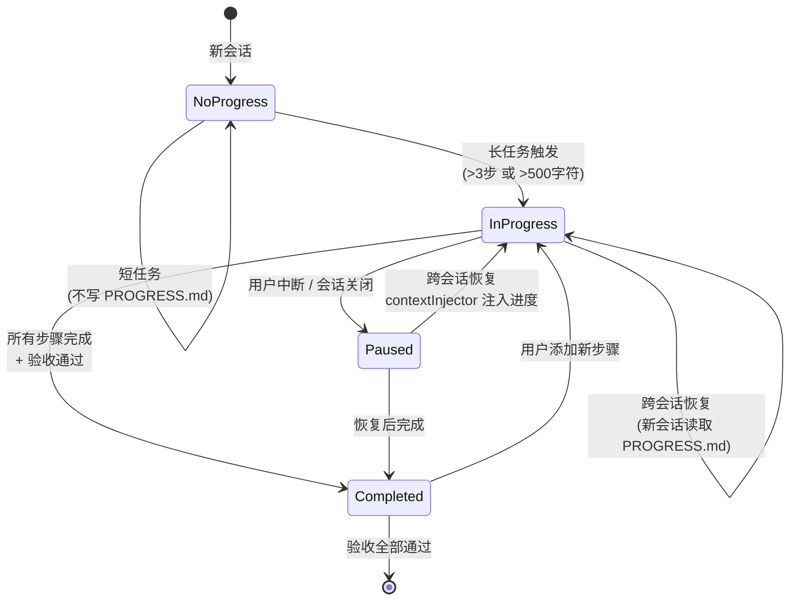
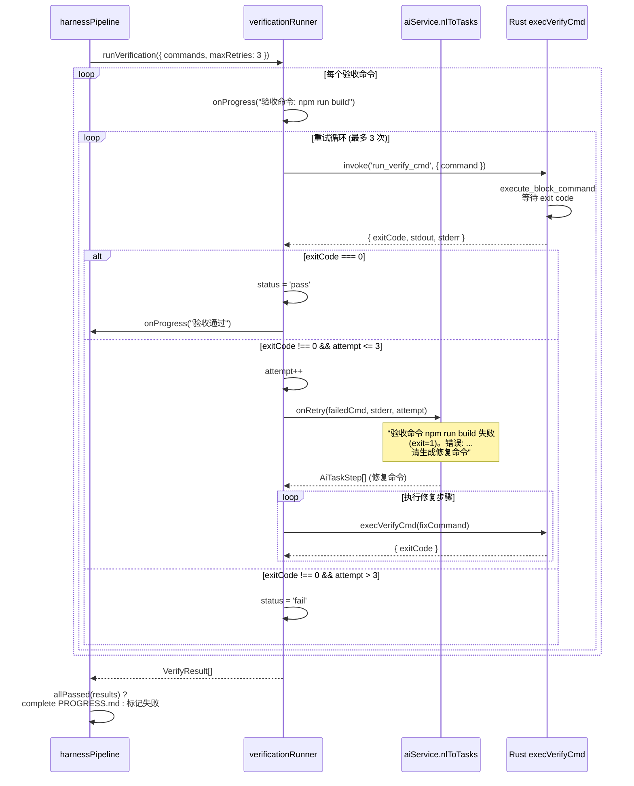

# 04 — 任务进度与验证系统

## 功能职责

进度与验证系统是 Harness 中间件的最后两层，负责：

1. **Progress Writer**：自动检测长任务，将进度持久化到 `PROGRESS.md`，支持跨会话恢复
2. **Verification Runner**：在任务完成后自动执行验收命令，失败时回传 LLM 修复（最多 3 次重试）

## 核心数据结构

### PROGRESS.md 模型 ([types.ts:48-60](../src/lib/harness/types.ts))

```typescript
type ProgressStatus = '进行中' | '已完成' | '已暂停';

interface ProgressSnapshot {
  status: ProgressStatus;
  taskDescription: string;
  completedSteps: StepRecord[];
  currentStep: string;
  pendingSteps: string[];
  verifyCommands: string[];
  notes: string;
  createdAt: string;      // ISO 日期 "2026-05-26 15:30"
  updatedAt: string;
}

interface StepRecord {
  command: string;
  description: string;
  exitCode: number;
}
```

### 验证结果 ([types.ts:63-72](../src/lib/harness/types.ts))

```typescript
interface VerifyResult {
  status: 'pass' | 'fail';
  command: string;
  exitCode: number;
  stdout: string;
  stderr: string;
  attempt: number;        // 第几次尝试
}
```

## 状态图

### PROGRESS.md 任务状态机



## 时序图

### 验证循环重试机制



## 代码逻辑框架

### Progress Writer ([progressWriter.ts:1-180](../src/lib/harness/progressWriter.ts))

#### 长任务检测

```typescript
function isLongTask(steps, stepThreshold, lengthThreshold): boolean {
  if (steps.length > stepThreshold) return true;  // 默认 >3 步
  const totalLength = steps.reduce((sum, s) => sum + s.command.length, 0);
  return totalLength > lengthThreshold;            // 默认 >500 字符
}
```

#### 写入时机

在 [harnessPipeline.ts:145-160](../src/lib/harness/harnessPipeline.ts) 的 Phase 4，所有命令执行完毕后：

```typescript
if (isLongTask(steps, config.longTaskStepThreshold, config.longTaskLengthThreshold)) {
  await progressWriter.save(sessionId, {
    taskDescription: userInput.slice(0, 200),
    completedSteps: [...],
    currentStep: '',
    pendingSteps: [],
    verifyCommands: injection.verifyCommands,
  });
  result.progressUpdated = true;
}
```

#### PROGRESS.md 格式

```markdown
# 任务进度
> **创建时间**: 2026-05-26 15:30
> **最后更新**: 2026-05-26 16:00
> **状态**: 进行中

## 已完成的步骤
- [x] `npm init -y` — 初始化项目 (exit: 0)
- [x] `npm install express` — 安装依赖 (exit: 0)

## 当前步骤
- [ ] `npm run dev` — 启动开发服务器

## 待办步骤
- [ ] `npm test`
- [ ] `git add . && git commit -m "feat: add express app"`

## 验收命令
- `npm run build`
- `npm test`
```

#### Markdown 解析

`parseProgress()` 使用正则从 Markdown 反向解析出 `ProgressSnapshot`。关键正则：

| 字段 | 正则 |
|------|------|
| 状态 | `/\*\*状态\*\*:\s*(.+)/` |
| 已完成步骤 | `/- \[x\]\s*`([^`]+)`\s*—\s*(.+?)\s*\(exit:\s*(-?\d+)\)/g` |
| 当前步骤 | `/## 当前步骤\s*\n- \[ \]\s*(.+)/` |
| 待办步骤 | `/## 待办步骤\s*\n([\s\S]*?)(?=\n##\|$)/` 中的 `/- \[ \]\s*(.+)/g` |
| 验收命令 | `/## 验收命令\s*\n([\s\S]*?)(?=\n##\|$)/` 中的 `/- `([^`]+)`/g` |

### Verification Runner ([verificationRunner.ts:1-127](../src/lib/harness/verificationRunner.ts))

#### 验证循环

```
runVerification({ commands, sessionId, maxRetries, onRetry, onProgress })
  │
  for each command:
  │
  ├─ 1. execVerifyCmd(sessionId, command, 30s timeout)
  │     └─ invoke('run_verify_cmd', { sessionId, command, timeoutSecs })
  │
  ├─ 2. exitCode === 0 ?
  │     YES → results.push({ status: 'pass', ... })
  │     NO  → attempt++
  │
  ├─ 3. attempt > maxRetries ?
  │     YES → results.push({ status: 'fail', ... }) → break
  │     NO  → onRetry(failedCmd, stderr, attempt)
  │           └─ 构建修复请求: "验收命令 X 失败 (exit=N)，错误: ...，请生成修复命令"
  │           └─ 调用 nlToTasks() 获取修复步骤
  │           └─ 执行修复步骤 → 回到步骤 1
  │
  └─ allPassed(results) → 所有验收命令通过
```

#### Rust 后端实现 ([harness_commands.rs:55-85](../src-tauri/src/harness_commands.rs))

```rust
#[tauri::command]
pub async fn run_verify_cmd(
    conn: State<'_, ConnectionManager>,
    session_id: String,
    command: String,
    _timeout_secs: u64,
) -> Result<VerifyCmdResult, String> {
    // 仅支持 SSH 会话
    if !session_id.starts_with("ssh-") {
        return Ok(VerifyCmdResult { exit_code: 0, ... });
    }
    // 使用 execute_block_command 派发命令
    conn.execute_block_command(&session_id, &command)
}
```

## 扩展点与约束

### 如何自定义长任务阈值

通过 `useSettingsStore.getState().updateHarnessSettings()` 修改：
```typescript
updateHarnessSettings({
  longTaskStepThreshold: 5,     // 超过 5 步才写 PROGRESS.md
  longTaskLengthThreshold: 1000,// 超过 1000 字符才写
})
```

### 如何新增验收命令

在项目根目录 `AGENTS.md` 的 `## 验收命令` 区块添加 `` ```bash ``` `` 代码块：

````markdown
## 验收命令

```bash
npx tsc --noEmit
cargo check
npm run build
```
````

### 约束

- **PROGRESS.md 路径**：仅存储在 `{workspace}/sessions/{session_id}/PROGRESS.md`
- **验证重试上限**：默认 3 次，超过后即使验证失败也会返回给用户
- **`run_verify_cmd` 限制**：当前仅 SSH 会话支持（[harness_commands.rs:60-68](../src-tauri/src/harness_commands.rs)），本地会话返回占位成功结果
- **验证命令执行**：通过 `execute_block_command` 派发，实际 exit code 依赖 `block-cmd-completed` 事件，存在异步延迟
