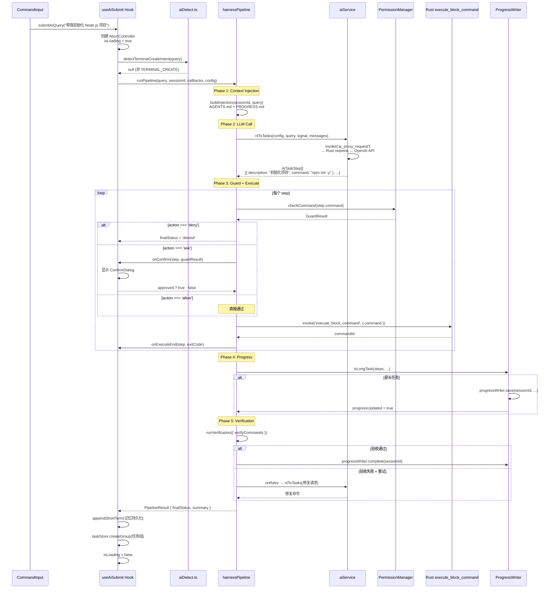

# 06 — AI 提交与 Pipeline 集成

## 功能职责

`useAiSubmit` Hook 是 AI 自然语言交互的唯一前端入口。在 Harness 系统集成后，它承担了以下职责：

1. **Phase 0**：正则快速匹配 `TERMINAL_CREATE` 意图，直接创建连接（绕过 LLM）
2. **Phase 1-5**：调用 `runPipeline()` 执行完整的 Harness 流水线
3. **ConfirmDialog 状态管理**：管理权限确认弹窗的打开/关闭/回调

## 核心数据结构

### Hook 接口 ([useAiSubmit.ts:24-38](../src/hooks/useAiSubmit.ts))

```typescript
interface UseAiSubmitReturn {
  submitAiQuery: (query: string) => Promise<void>;
  cancelAiQuery: () => void;
  isLoading: boolean;
  error: string | null;
  clearError: () => void;
  confirmDialog: {
    open: boolean;
    step: AiTaskStep | null;
    guardResult: GuardResult | null;
    onChoose: (choice: 'deny' | 'allow-once' | 'allow-all') => void;
    onDismiss: () => void;
  };
}
```

## 时序图

### useAiSubmit 全链路调用时序



## 代码逻辑框架

### 完整执行流程 ([useAiSubmit.ts:110-195](../src/hooks/useAiSubmit.ts))

```
submitAiQuery(query: string)
  │
  ├─ 1. 防重入检查: if (isLoading) return
  │
  ├─ 2. 创建 AbortController, 设置 isLoading=true
  │
  ├─ 3. Phase 0: 正则快速匹配
  │     detectTerminalCreateIntent(query)
  │     └─ 命中 → executeTerminalCreate() → 创建终端连接 → return
  │
  ├─ 4. Phase 1-5: Harness Pipeline
  │     runPipeline(query, sessionId, {
  │       signal: controller.signal,
  │       onProgress: (status) => out.append(status),
  │       onConfirm: async (step, guardResult) => {
  │         if (allowAllRef.current) return true;  // 已全部允许
  │         return new Promise<boolean>((resolve) => {
  │           confirmResolveRef.current = resolve;
  │           setConfirmStep(step);
  │           setConfirmGuard(guardResult);
  │           setConfirmOpen(true);                // 显示弹窗
  │         });
  │       },
  │       onExecuteStart: (step) => out.append(`  $ ${step.command}  — ${step.description}`),
  │       onExecuteEnd: (step, exitCode) => { /* Block 事件系统跟踪实际 exit code */ },
  │     }, harnessConfig)
  │
  ├─ 5. 处理结果
  │     ├─ denied → out.append('任务被安全策略拒绝')
  │     ├─ failed → out.append('任务执行或验证失败')
  │     └─ 其他  → out.append(result.summary)
  │
  ├─ 6. 持久化到记忆
  │     appendShortTerm(memoryId, [
  │       { role: 'user', content: query },
  │       { role: 'assistant', content: stepsDescription },
  │     ])
  │
  └─ 7. 创建任务组
        useTaskStore.getState().createGroup(sessionId, query, result.steps)
        useUiStore.getState().setSidebarTab('tasks')
```

### ConfirmDialog 回调机制

```
用户点击"全部允许"
  → allowAllRef.current = true
  → confirmResolveRef.current(true)
  → Promise resolve → onConfirm 返回 true
  → 后续 ask 命令: allowAllRef.current === true → 直接返回 true，不弹窗

用户点击"允许本次"
  → confirmResolveRef.current(true)
  → Promise resolve → 当前命令放行
  → 下次 ask 命令: allowAllRef 仍为 false → 重新弹窗

用户点击"拒绝" / Escape / 点击遮罩
  → confirmResolveRef.current(false)
  → Promise resolve → 当前命令跳过
```

### Layout 集成 ([Layout.tsx:62-66,186-194](../src/components/Layout.tsx))

```tsx
// Hook 调用
const { submitAiQuery, ..., confirmDialog } = useAiSubmit({ sessionId });

// ConfirmDialog 渲染（在所有 Modal 之后）
<ConfirmDialog
  open={confirmDialog.open}
  command={confirmDialog.step?.command ?? ''}
  description={confirmDialog.step?.description ?? ''}
  reason={confirmDialog.guardResult?.auditEntry?.reason}
  onChoose={confirmDialog.onChoose}
  onDismiss={confirmDialog.onDismiss}
/>
```

## 扩展点与约束

### 如何扩展 submitAiQuery 的预处理

在 `submitAiQuery` 中 Phase 0 之前添加新的快速匹配逻辑（如正则检测特定领域关键词）。

### 约束

- **串行执行**：`runPipeline` 内部串行执行所有步骤，不支持并行命令
- **AbortController 不是全局的**：每次 `submitAiQuery` 调用创建新的 AbortController，前一个未完成的调用会被 abort
- **输出通过 outputStore**：所有用户可见的进度文本通过 `useOutputStore.append()` 输出，不通过 React 组件直接渲染
- **confirmDialog 状态由父组件渲染**：Hook 只管理状态，实际的 ConfirmDialog DOM 由 Layout 渲染
