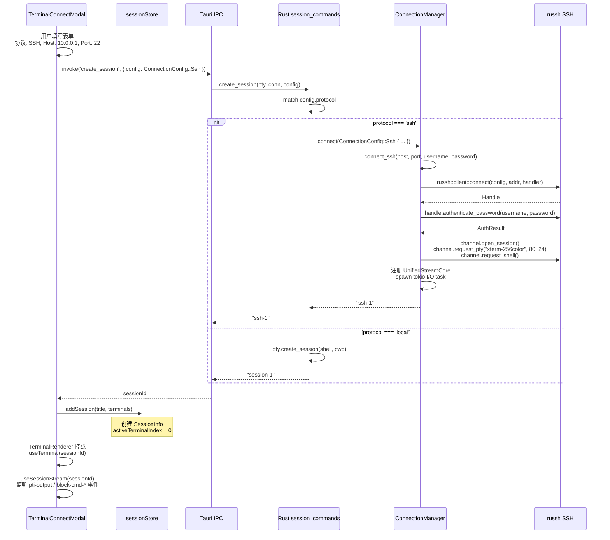

# 08 — 会话管理与多协议连接

## 功能职责

会话管理是终端连接的生命周期中枢，负责：
- 会话的创建、激活、销毁
- 多终端 Tab 管理（一个会话可有多个终端连接）
- 连接配置的持久化（加密存储）
- 会话日志的流处理

## 核心数据结构

### Session Store ([sessionStore.ts](../src/stores/sessionStore.ts))

```typescript
interface SessionInfo {
  id: string;                          // 如 'session-1' 或自动生成的 UUID
  title: string;
  terminals: TerminalInstance[];       // 该会话下的所有终端 Tab
  activeTerminalIndex: number;
  status: SessionStatus;               // 'connecting' | 'connected' | 'disconnected'
}

interface TerminalInstance {
  id: string;
  config: ConnectionConfig;            // 连接配置（协议/主机/端口/凭据）
  connectionId: string;                // 后端 Session ID（如 'ssh-1'）
  isLogging: boolean;                  // 是否开启日志录制
}
```

### ConnectionConfig ([connection.ts](../src/models/connection.ts))

```typescript
type ConnectionConfig =
  | { protocol: 'ssh';    host: string; port: number; username: string; password: string }
  | { protocol: 'telnet'; host: string; port: number }
  | { protocol: 'serial'; portName: string; baudRate: number; dataBits: number; stopBits: number; parity: string }
  | { protocol: 'local';  shell: string; cwd?: string }
```

### Session ID 路由 ([sessionUtils.ts:3-20](../src/lib/sessionUtils.ts))

```typescript
function getWriteCommand(sessionId: string): string {
  if (sessionId.startsWith('session-')) return 'write_to_terminal';
  return 'write_to_connection';  // ssh- / telnet- / serial-
}

function getResizeCommand(sessionId: string): string {
  if (sessionId.startsWith('session-')) return 'resize_terminal';
  return 'resize_connection';
}
```

## 时序图

### 会话创建与数据流



## 代码逻辑框架

### 会话创建流程

```
用户点击 "+ New" → SessionTypeModal → TerminalConnectModal
  │
  ├─ 填写连接表单（协议/主机/端口/凭据）
  │
  ├─ invoke('create_session', { config: ConnectionConfig })
  │   └─ Rust: session_commands::create_session()
  │       ├─ Local → PtyManager.create_session()
  │       │   └─ portable-pty → session-N
  │       └─ SSH/Telnet/Serial → ConnectionManager.connect()
  │           └─ ssh-N / telnet-N / serial-N
  │
  └─ 前端: addTerminal(sessionId, config, label)
      └─ sessionStore.addSession() / addTerminal()
```

### UnifiedSessionPanel 渲染 ([UnifiedSessionPanel.tsx](../src/components/UnifiedSessionPanel.tsx))

基于活动终端的 `connectionId`，通过 `useSessionStream` 监听 Rust 后端事件：
- `pti-output` → terminal.write()（xterm.js 渲染）
- `block-output` → sessionLogStore.appendLog()
- `block-cmd-started` → sessionLogStore.appendLog({ type: 'command-start' })
- `block-cmd-completed` → sessionLogStore.appendLog({ type: 'command-end' })

### 持久化恢复 ([usePersistenceBootstrap.ts](../src/hooks/usePersistenceBootstrap.ts))

应用启动时，从 `{workspace}/sessions/` 目录读取所有会话数据，恢复到 `sessionStore`：
- `meta.json` → 会话元信息
- `session.timeline.ndjson` → 会话日志（ndjson 格式，每行一个 SessionEvent JSON）
- `editor.json` → 编辑器状态

## 扩展点与约束

### 约束

- **Session ID 前缀路由**：所有写/调大小操作通过 `sessionUtils.getWriteCommand/getResizeCommand` 根据前缀分发，不可绕过
- **加密存储**：连接密码使用 AES-256-GCM 加密，密钥存储在 `{workspace}/.key`
- **连接配置树形结构**：通过 `connectionStore.buildTree()` 将扁平连接列表转换为支持拖拽排序的树形结构
